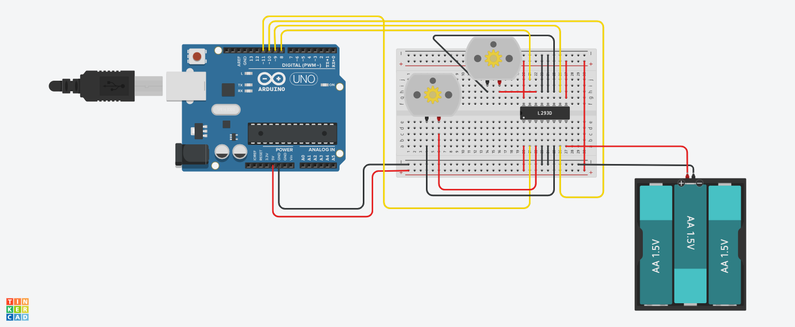

# Dual DC Motor Driver with L298N and Arduino

A minimal Arduino project to control two DC motors using an **L298N Motor Driver Module**. Ideal for learning motor control in robotics and embedded systems.

---

## 📦 Components

> Refer to [`components.text`](components.text) for detailed specs.

- **Arduino Uno/Nano** – microcontroller to process control logic
- **L298N Dual H-Bridge Motor Driver** – allows bi-directional control of 2 motors
- **2x DC Motors** – standard geared motors
- **Power Supply** – 9V battery / DC adapter
- **Jumper Wires** – for all connections
- **Breadboard** (optional) – for rapid prototyping

---

## 🧠 How It Works

The L298N receives logic signals from Arduino digital pins to control each motor’s direction. By setting pairs of input pins (IN1/IN2, IN3/IN4) HIGH/LOW, you control direction; setting both LOW stops the motor.

---

## 🔌 Circuit Diagram

> 

- **IN1/IN2** control Motor A
- **IN3/IN4** control Motor B
- Motors powered via the L298N's onboard terminals
- Optional: ENA/ENB pins for PWM speed control

---

## 🧾 Arduino Code

> See [`dual_motor_driver.ino`](dual_motor_driver.ino) for complete source.

---
